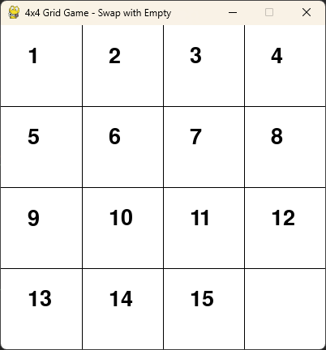
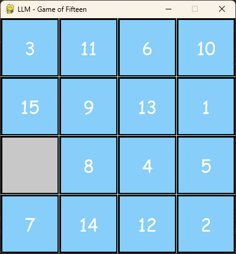

# Python Game Of Fifteen
This repository contains a basic Game of Fifteen game using pygame. None of its code was written by human, instead it was written by prompting various LLMs such as ChatGPT, Mistral, and others - basic requirements, requests for bug fixes and adjustments have been requested by author.

There will be probably many confusing changes introducing many bugs, as I repeatedly ask LLMs to fix the same issue over and over again. But overall, it seems the functionality is improving, you can already somehow play ... 

